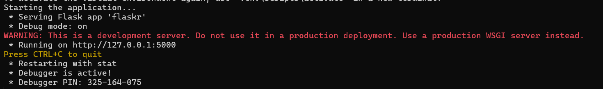

# flask-tiny-app

### Personal Information :
    Full name: Truong Cong Dat
    Student ID: 22685561

### Description
- Build a simple blog web with flask.
- Website has two types of user: admin and user. Admin account can manage user account.
- Funtions of user account:
    - Create new post
    - Edit post
    - Delete post
    - View another post by another user
- Funtions of admin account:
    - Include funtions of user account
    - Manage user 

### Setting instruction
***I. Run with Command Prompt*** 
1. Open Command Prompt, navigate to the project folder and run this command: ```$ setup.py```


2. Then press `Ctrl` and click on the link: ```http://127.0.0.1:5000```



3. Then register or login. Admin account:
    - username: ```admin```
    - password: ```admin```


***II. Run with Docker*** 
1. Open `Docker Desktop` app on your desktop

2. *Build Docer image*: Open Command Prompt, navigate to the project folder and run this command: ```docker build -t flask-tiny-app .```

3. After completed building image, run this command for run container: `docker run -p 5000:5000 flask-tiny-app`

4. Then press `Ctrl` and click on the link: ```http://127.0.0.1:5000```


5. Then register or login. Admin account:
    - username: ```admin```
    - password: ```admin```

### Link project 
    


