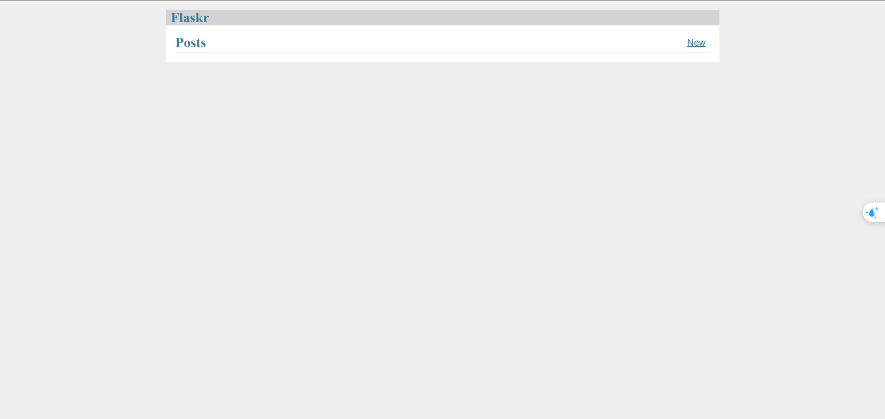
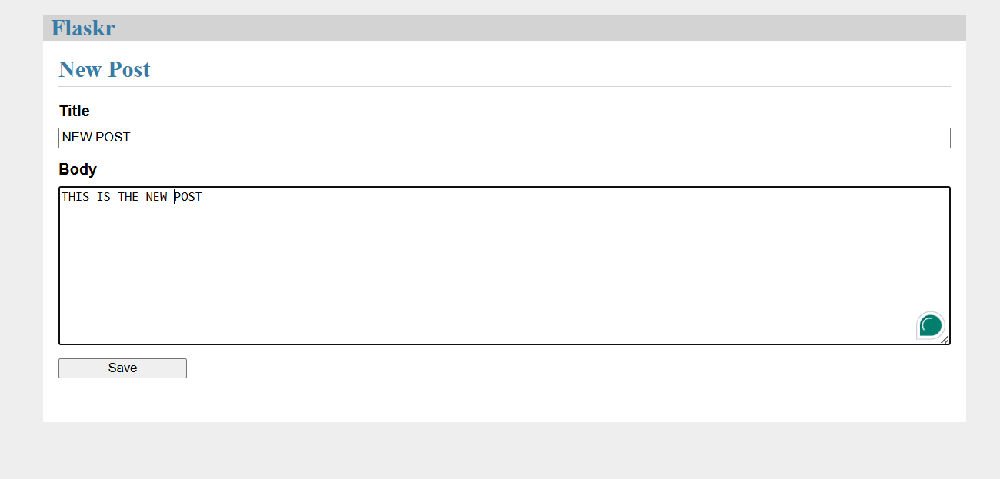
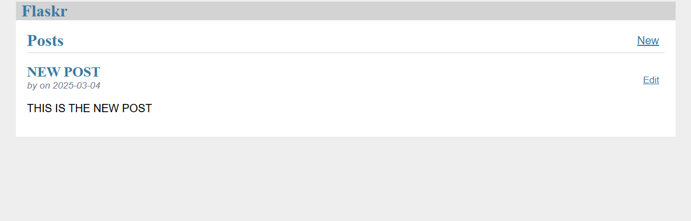
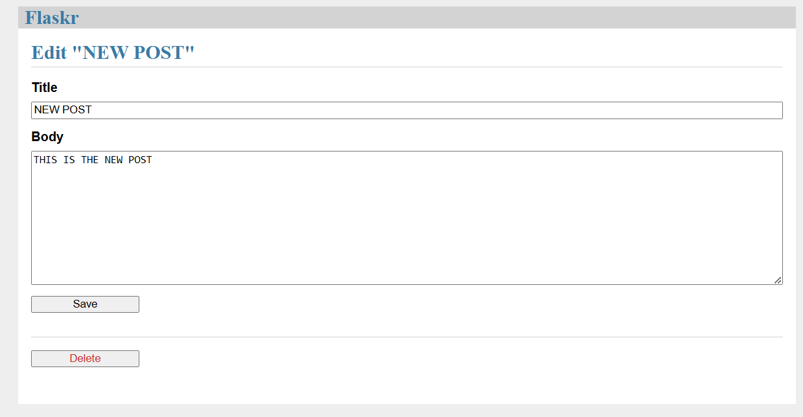
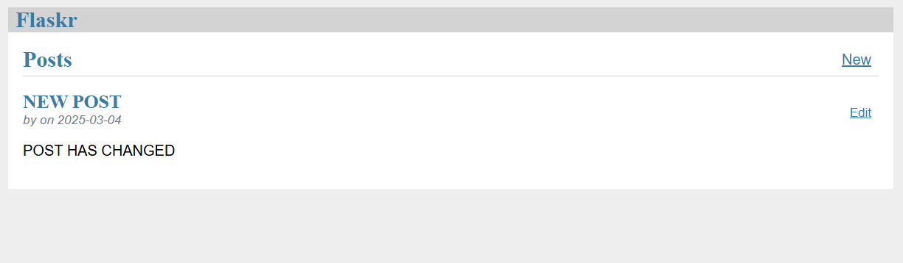
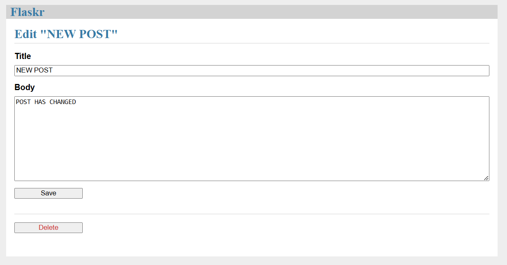
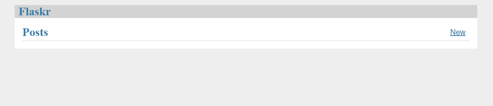

# **flask-tiny-app version 1**

- **Description**: Website on version 1 can create new post, edit post and delete it.

-----

#### INTERFACE ON VERSION1 

----

#### CREATE NEW POST

----

#### EDIT POST

----

#### DELETE POST

