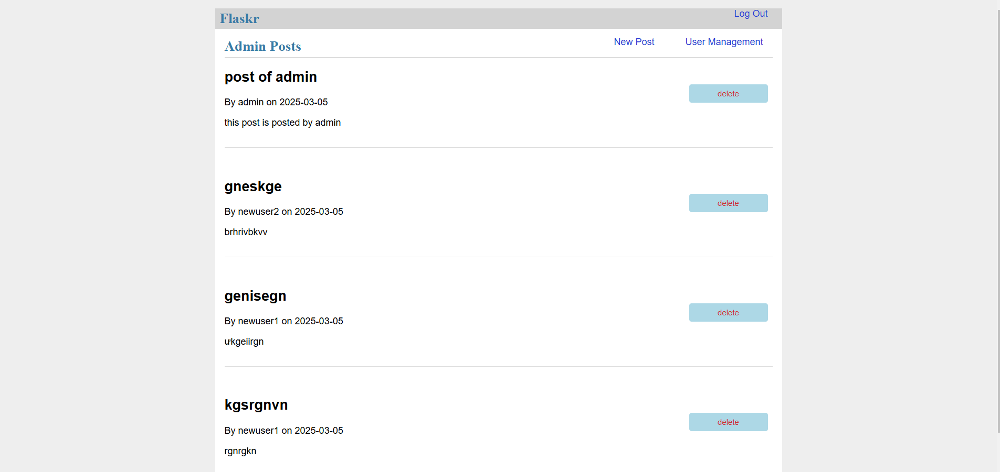
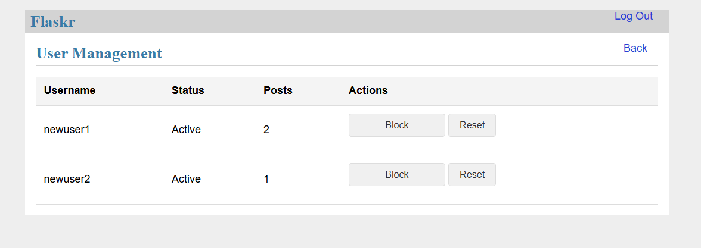
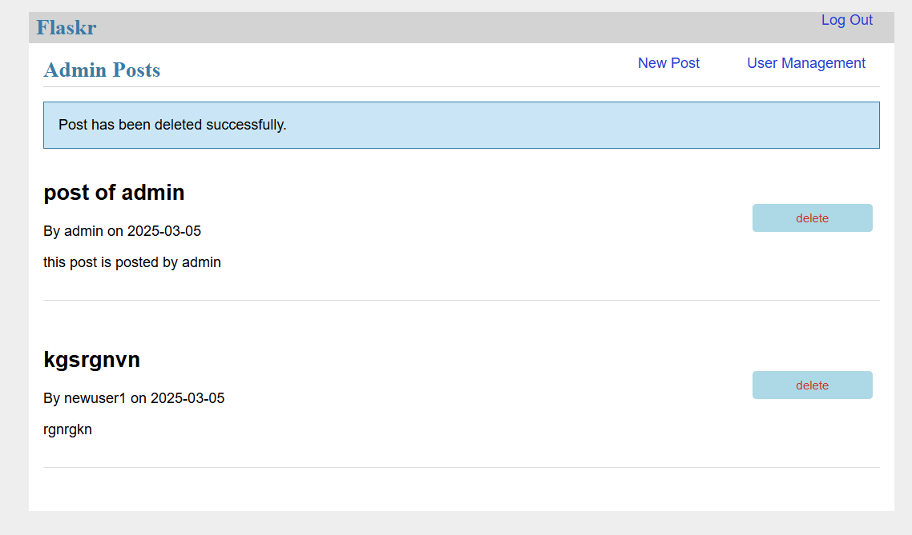
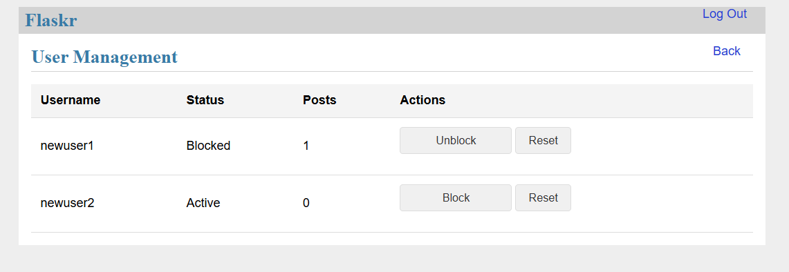
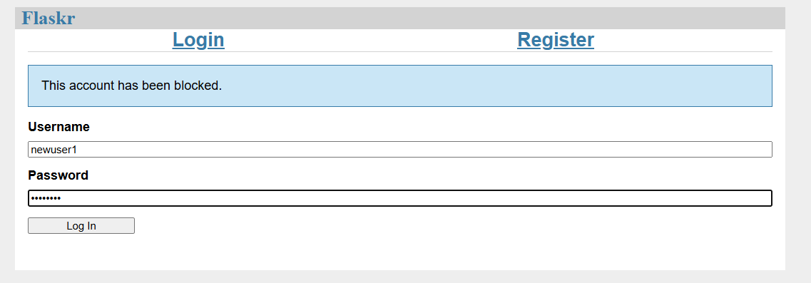
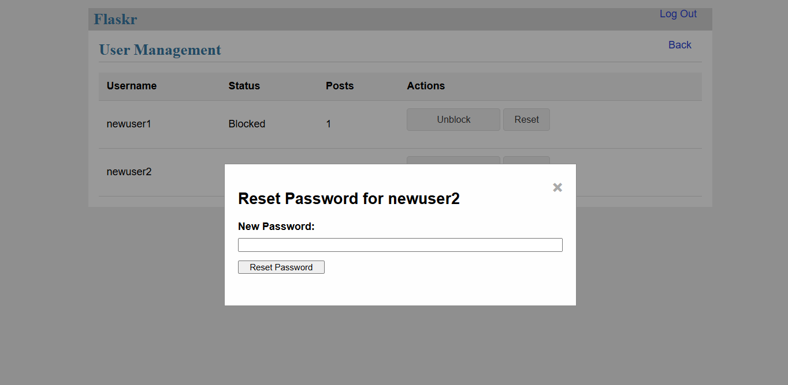

# **flask-tiny-app version 3**

- **Change compare version 2**: this version create two types of user: admin and user. Admin has same function with user and they can block user account, delete user post, reset password for user. If users is blocked by admin, they couldn't visit their accounts.

----

### INTERFACE OF ADMIN 

----

### INTERFACE OF USER-MANAGEMENT

----

### DELETE USER POST

----

### BLOCK USER

----

### USER IS BLOCKED

----

### RESET PASSWORD FOR USER

