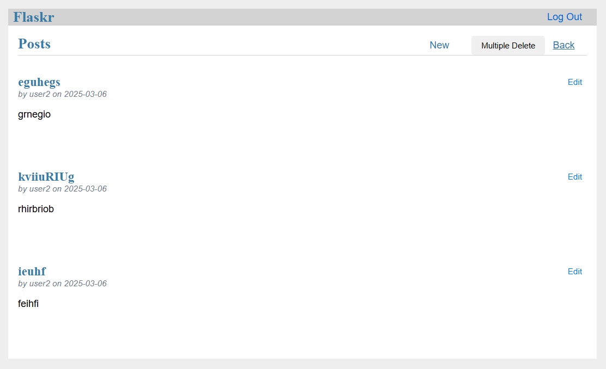
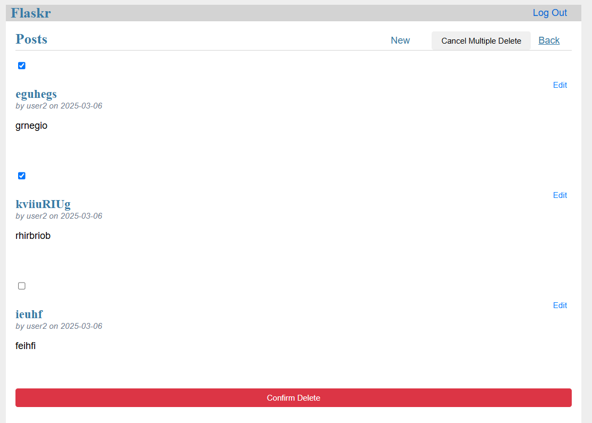

# **flask-tiny-app version 4**

- **Change compare version 3**: this  version has added "My post" function, this function is allowed users to review, edit they's post, create new post and multiple delete post. 

----

### INTERFACE OF 'MY POST' FUNCTION

----

### MULTIPLE DELETE POST

